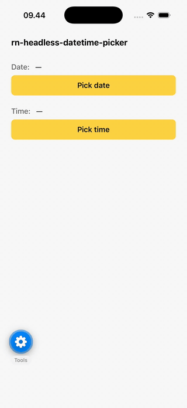
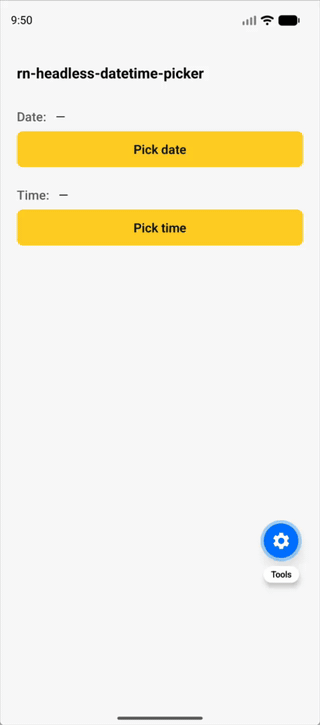

# rn-headless-datetime-picker

A **headless**, promise-based date and time picker for React Native — built on top of [`@react-native-community/datetimepicker`](https://github.com/react-native-datetimepicker/datetimepicker). You bring the trigger UI; this library handles the platform-native picker chrome (iOS modal + Done button, Android dialog).

- **Promise-based** — `const date = await pickDate()` returns `Date | null` (`null` on dismiss).
- **Headless** — no opinionated trigger component. Wrap your own button, input, or anything else.
- **Expo-friendly** — works in Expo Go without prebuild. Ships an optional Expo config plugin to tint the Android dialog with your brand color.
- **Tiny surface** — three functions, one host component.

## Demo

<table>
  <tr>
    <td align="center"><strong>iOS</strong></td>
    <td align="center"><strong>Android</strong></td>
    <td align="center"><strong>Android (with <code>accentColor</code>)</strong></td>
  </tr>
  <tr>
    <td></td>
    <td></td>
    <td></td>
  </tr>
</table>

## Install

```sh
# npm
npm install rn-headless-datetime-picker @react-native-community/datetimepicker

# yarn
yarn add rn-headless-datetime-picker @react-native-community/datetimepicker

# pnpm
pnpm add rn-headless-datetime-picker @react-native-community/datetimepicker

# bun
bun add rn-headless-datetime-picker @react-native-community/datetimepicker
```

`@react-native-community/datetimepicker` is a peer dependency — install it explicitly.

## Setup

Mount `<DateTimePickerHost />` **once** at the root of your app. It owns the picker lifecycle and listens for `pickDate`/`pickTime` calls from anywhere in your tree.

```tsx
// App.tsx
import { DateTimePickerHost } from 'rn-headless-datetime-picker';

export default function App() {
  return (
    <>
      <YourAppRoot />
      <DateTimePickerHost />
    </>
  );
}
```

## Usage

```tsx
import { pickDate, pickTime } from 'rn-headless-datetime-picker';

// In any component
const onPickDate = async () => {
  const date = await pickDate({
    initial: new Date(),
    min: new Date(2020, 0, 1),
    max: new Date(2030, 11, 31),
  });
  if (date) {
    // user confirmed — `date` is a Date instance
  }
  // null means the user dismissed
};

const onPickTime = async () => {
  const time = await pickTime({ is24Hour: false });
};
```

### Global defaults

Set defaults once instead of passing the same options on every call:

```tsx
import { configureDateTimePicker } from 'rn-headless-datetime-picker';

configureDateTimePicker({
  accentColor: '#FFD443',
  themeVariant: 'dark',
  doneLabel: 'Done',
});
```

### Host styling

Pass static styles to the host. They apply to every picker rendered.

```tsx
<DateTimePickerHost
  containerStyle={{ backgroundColor: '#1A1A1A' }}
  backdropStyle={{ backgroundColor: 'rgba(0,0,0,0.7)' }}
  doneTextStyle={{ color: '#FFD443' }}
/>
```

## API

### `pickDateTime(options?: PickDateTimeOptions): Promise<Date | null>`

Returns the picked date or `null` if dismissed.

### `pickDate(options?)`, `pickTime(options?)`

Convenience wrappers — same as `pickDateTime` with `mode` pre-set.

### `configureDateTimePicker(defaults)`

Set global defaults merged into every call. Per-call options override defaults.

### `PickDateTimeOptions`

| Option | Type | Notes |
|---|---|---|
| `mode` | `'date' \| 'time'` | Default `'date'` |
| `initial` | `Date` | Default: `new Date()` |
| `min`, `max` | `Date` | Constrain selectable range |
| `accentColor` | `string` | iOS tint; Android needs the config plugin (see below) |
| `themeVariant` | `'light' \| 'dark'` | iOS chrome |
| `textColor` | `string` | iOS picker text |
| `doneLabel` | `string` | iOS "Done" button label (i18n) |
| `is24Hour` | `boolean` | Time mode |
| `iosDisplay` | `'inline' \| 'spinner' \| 'compact'` | Default: `inline` for date, `spinner` for time |
| `androidDisplay` | `'default' \| 'spinner' \| 'calendar' \| 'clock'` | Android dialog flavor |

## Expo config plugin (optional)

iOS picks up `accentColor` from the per-call option. Android's native date dialog ignores props and pulls its tint from `AppTheme.colorAccent` — which can only be set via a config plugin that requires a **prebuild**.

### If you don't prebuild

You can still use the library in Expo Go. The Android dialog will use Material's default accent (purple/teal depending on Android version), but the picker still works.

### If you want brand-tinted Android dialogs

Add the plugin to `app.json` and prebuild:

```json
{
  "expo": {
    "plugins": [
      "@react-native-community/datetimepicker",
      ["rn-headless-datetime-picker", { "accentColor": "#FFD443" }]
    ]
  }
}
```

```sh
npx expo prebuild
```

The plugin sets `colorAccent` and `colorControlActivated` on `AppTheme`, which also tints other AppCompat-style controls (Switch, CheckBox, RadioButton, text-input cursors). If you omit `accentColor`, the plugin is a no-op.

## Why "headless"?

The native picker chrome (the iOS scrollable wheels, the Android calendar dialog) is platform UX — consumers shouldn't restyle that. But the *trigger* (button, text input, list row, custom shape) varies wildly from app to app. So this library:

- Owns the picker chrome (so it's correct everywhere).
- Doesn't own the trigger (so you build whatever fits your design).

Time picker on iOS uses a **draft staging** pattern: scrolling the spinner doesn't commit until you tap "Done", so the user can cancel by tapping the backdrop.

## Roadmap

- `mode: 'datetime'` — currently use `pickDate()` then `pickTime()` in sequence.
- Web support — the underlying picker doesn't have a great web fallback yet.

## Contributing

- [Development workflow](CONTRIBUTING.md#development-workflow)
- [Sending a pull request](CONTRIBUTING.md#sending-a-pull-request)
- [Code of conduct](CODE_OF_CONDUCT.md)

## License

MIT

---

Made with [create-react-native-library](https://github.com/callstack/react-native-builder-bob)
